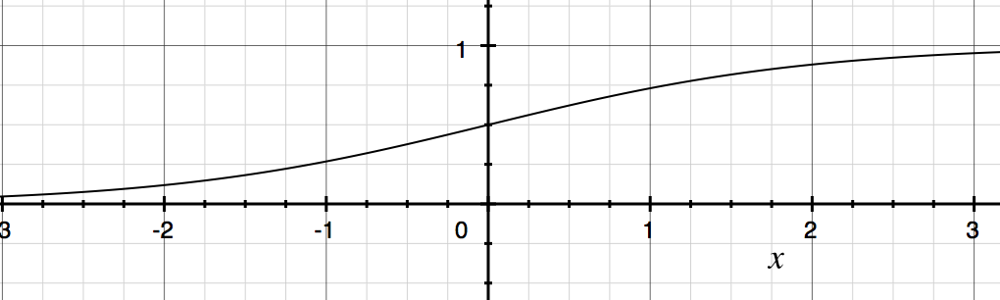

#**Neural Network module** 

###high level descrition and analysis

---

**general overview**

The module allows for a feed foreward neural network to be created using any arbitrary size and any number of layers. The methods are as follows:

* init(num neurons per layer) initializes the network to contain as many neurons as are specified by num neurons per layer, will attempt to read in from a file, or creates new weights if none were found
* Sigmoid(x, deriv): computes the sigasoid function or its derivative for any value of x
* dot with func(x, y, func): computes the dot product on x and y, applying the function func to every value in the new computed array
* get_output(data): computes the networks output for any given input data
* train(input data, output data): trains the network by teaching it to approximate the output data given the input data
* backpropigate(final error): backpropigates the error the the network given the final error of the final node(s)
* save data(): saves the networks weights into files in the current directory
* read data(): reads data previously saved by save data in the current directory

---

####lower level description of methods

**init**

arguments:

* num neurons per layer: an array of the number of neurons to have in each layer, for example: [5, 3, 2, 2] would mean a network with 5 inputs, connected to a hidden layer of 3 neurons, connected to a hidden layer of 2 neurons, connected to an output layer of 2 neurons

init is called when first constructing a neural network object. It will take in as parameters the number of neurons per layer. It automatically attempts to read in data stored by previous networks in the current directory. If the files are not found or there was some error in the files (wrong format, wrong size, file missing, etc) it will randomly initialize the weights. init will also initialize the layers to all be zero (layers is the output of each neuron, when nothing has been done, the neurons have not fired yet and thus layers is all zeros).

**sigmoid**

arguments:

* x: the value to compute the sigmoid value (or to compute the derivative of the sigmoid function for).
* deriv: true if user wants the derivative of the sigmoid function, false if the user wants the regular sigmoid function. deriv is False unless otherwise specified. 

The sigmoid function computes the value 1 / (1 + e^-x) or its derivative sigmoid(x) * (1 - sigmoid(x)). The sigmoid function is used as the activation function for the neural network. Each "neuron" accepts as input the outputs of all connected neurons multiplied by their respective weights and computes the value sigmoid(sum) as its output. The derivative is used in backpropegation in order to determain how much change is neccesary. If the value of the derivative is very small (the value of the sigmoid function was either very large or very small) the network was reasonably sure about its output and little change will occur. If the value of the derivative was large (the value of the sigmoid function was around 0.5) the network really was not very sure of its output and therefor lots of change is needed to get the network to "pick" either 0 or 1 for its output.

The following is an image of the sigmoid function.

The following is an image of the derivative of the sigmoid function. Notice how near x = 0 the derivative is very large while the sigmoid function is mid range, around 0.5. Conversly, near the two opposite ends of the graph ( x < -2 and x > 2

